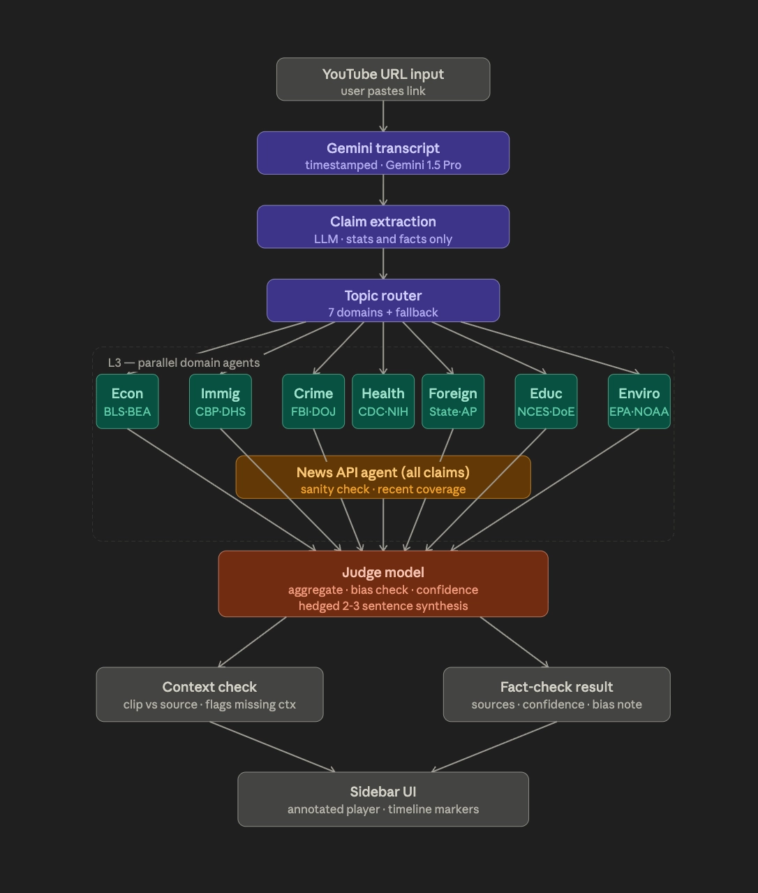

# GroundView: Fact and Opinion Checker Browser Extension -- BeaverHacks 2026
Team: Cole, Tyler, David, Kevin

> **One-sentence pitch:** "We built a fact and opinion checker for political debates and speeches on YouTube."

**Track: ConductorOne** — Our agentic architecture includes an orchestrator, parallel agents, scoped domain tools, eval harness, and judge model.

### What it is (Solution)
A YouTube fact-check layer for political content. It overlays on the YouTube page, we process the video and transcription, the user gets an interactive view of fact cards showing every verifiable claim annotated on the timeline with sourced context without having to leave the page.

### The problem it solves (Problem Scope)
Misinformation is rampant across the internet and unbiased fact-checking is difficult. This solves two main issues:
1. **Real-time verification:** Political debate claims are hard to verify in real time — people either take them at face value or stop watching to Google.
2. **Out-of-context clips:** Viral political clips spread out of context — a 10-second clip can mean the opposite of what the full speech says. We specifically focus on short form content (Shorts, TikTok, Reels, etc.) where this spreads misinformation to millions quickly.

### How it works (Agentic Infrastructure)
- **Gemini** extracts a timestamped transcript from the YouTube URL.
- **LLM** extracts checkable factual claims only.
- **Topic router** classifies each claim.
- **3 domain-specific agents** verify in parallel across 5 sources.
- **Judge model** synthesizes an honest 2-3 sentence response — never a binary verdict, always hedged, always cited.
- Results render as a sidebar alongside the video with timeline markers.

### What makes it different
- Allow users to simulatenously verify facts and opinions.
- Not a verdict machine — surfaces context and lets users decide
- Flags out-of-context clips, not just false claims
- Aggregates 8 topics (domains) and discloses when sourcing is skewed/biased.
- Consumer-facing tool

### Future Directions
- Have this app be used as an overlay on live streams to check for misinformation.
- Pitch to social media platforms such as YouTube and TikTok to use this as a feature on their platform.

### Contributions
For running the backend server: 'backend/venv/bin/python -m uvicorn backend.main:app --host 127.0.0.1 --port 8000'
For running the browser extension locally:
1. On Chrome, go to: chrome://extensions/
2. Enable Developer Mode
3. Click Load Unpacked
4. Select and Upload the 'chrome-extension' folder

